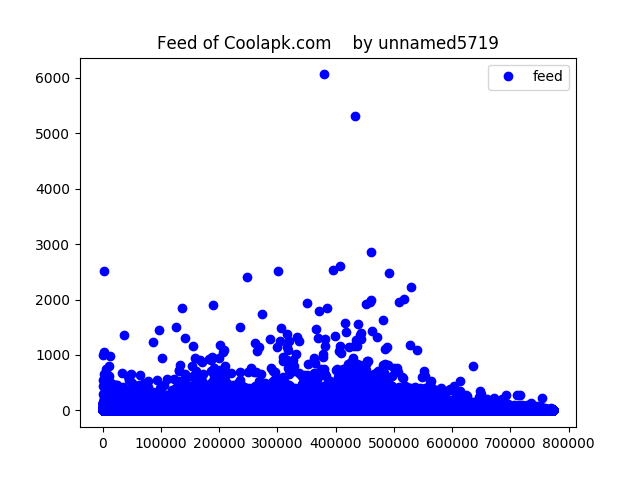
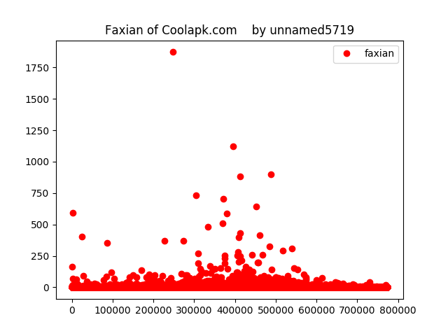
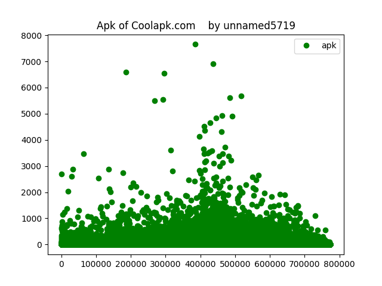
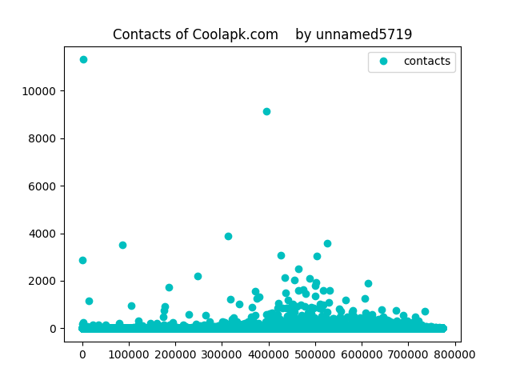

#酷安大数据（伪）    
######仅供娱乐   

在1月20号~~(其实是13号)~~的时候有这么一个想法：    
`把酷安的用户跑一遍`    

然后今天跑完了23333    
######~~希望没给酷安服务器造成压力23333~~

下面是部分结果，所有数据基于网页版，截至`2017年1月24日 10:24:06`或更早，见各id段开始爬的时间

id中存在unicode字符的人也有统计，有`955`人，~~不要问为什么:(~~

全酷安共`780154`用户，保留（封禁）用户共`5402`人，占比约`0.692%`

有`774752`个正常用户

其中`585145`人连一个动态都没发，一个应用也没关注，一个应用也没发现，一个粉丝也没有，占活人里面约`75.527%`

其中unicode用户占总unicode用户里面的`61.78%`

特殊id：`@11608` 居然是空的！

未知id：`@552278` `@576115` `@633059` `@669887` `@692245` id有超出字符集的字符，注册的时候没有过滤吗...

##酷安动态top10:

排名|用户名|动态数
----|--------- | --------
十|`@Trumeet`   |     `2225`  
九|`@zesty`     |   `2410`  
八|`@Fince`     |   `2476`  
七|`@zhuangpan`  |      `2516`  
六|`@酷安小编`   |     `2516`  
五|`@八百标兵`   |     `2538`  
四|`@lyh123`    |    `2606`  
三|`@绯色の炎`   |     `2851` 
二|`@wsndd321`   |     `5309`  
一|`@夜之浪子`    |    `6063`  

##酷安关注应用top10：

排名|用户名|关注应用数
----|:---------: | :--------:
十|`@linyoq`   |`4901`  
九|`@投影仪落`    |    `4936`  
八|`@aiboers110`  |    `5488`  
七|`@囧机油aprilone`|  `5536`  
六|`@韩国123456`   |   `5607`  
五|`@pandecheng`  |    `5690`  
四|`@chendeshen`  |    `6540`  
三|`@lqmouse`     |    `6595`  
二|`@西兮兮S`     |    `6920`  
一|`@苏阿墨`      |    `7653`  

##酷安发现top10：

排名|用户名|发现应用数
----|:---------: | :--------:
十|`@EMK2000`   |     `511`  
九|`@夜之浪子`   |    `590`  
八|`@酷安小编`   |    `595`  
七|`@feemo`     |     `641`  
六|`@suesyria`   |    `702`  
五|`@阿明1975`    |   `734`  
四|`@小姐上门服务` |  `880`  
三|`@海盗湾`      |   `899`  
二|`@八百标兵`    |   `1124`  
一|`@zesty`      |   `1872`  

##酷安粉丝top10：

排名|用户名|粉丝数
----|:---------: | :--------:  
十|`@zesty`      |    `2187`  
九|`@zhou45`     |    `2515`  
八|`@阿酷`        |    `2886`  
七|`@fkzhang`     |    `3042`  
六|`@various`     |    `3086`  
五|`@tastypear`   |    `3509`  
四|`@辣椒爱上水果`  |  `3577`   
三|`@尘封之泪`     |   `3893`  
二|`@八百标兵`     |   `9122`   
一|`@酷安小编`     |   `11304`  

___

###以下是图表

####动态散点图    
    
####发现散点图    
    
####应用集散点图    
    
####粉丝散点图    
    

####各id段开始爬的时间
######~~(其实可以在一天之内跑完的)~~

`10001`  `2017年1月21日 19:08:01`  
`110529` `2017年1月21日 22:38:01`~~(掐这这个时间按的ctrl+c)~~  

`110530` `2017年1月22日 19:50:12`(误差在一分钟内)  
`131185` `2017年1月22日 20:46:54`  

`131186` `2017年1月22日 20:52:57`(误差在一分钟内)  
`179407` `2017年1月22日 22:26:17`  

`179408` `2017年1月23日 15:32:50`(误差在一分钟内)  
`784578` `2017年1月24日 10:11:46`(没错跑了一个晚上)  

`784579` `2017年1月24日 10:14:52`  
`790156` `2017年1月24日 10:24:06`  

___

 本作品采用<a rel="license" href="http://creativecommons.org/licenses/by-nc/4.0/">知识共享署名-非商业性使用 4.0 国际许可协议</a>进行许可。
